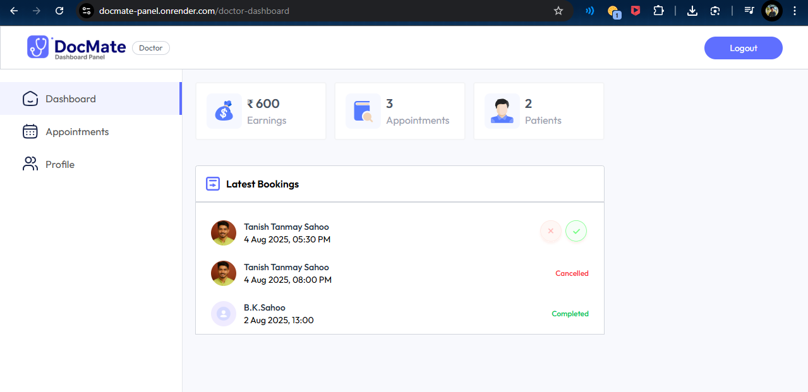
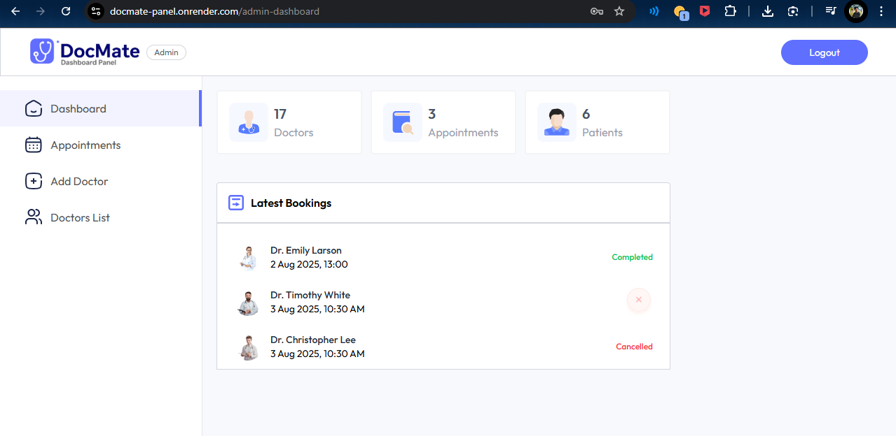

# 🩺 DocMate – Doctor Appointment Booking System

**DocMate** is a full-stack Doctor Appointment Booking System that enables seamless interaction between Patients, Doctors, and Admins. The platform provides a structured and secure approach to scheduling, managing, and tracking appointments.

🔗 **Live Preview:** [https://docmate-8ygo.onrender.com](https://docmate-8ygo.onrender.com)

---

## ✨ Features

### 👤 Patient
- Browse through the list of available doctors.
- Book appointments for specific dates and time slots.
- View and manage appointment history.
- Update profile details.

### 🩺 Doctor
- View assigned appointments.
- Cancel or mark appointments as completed.
- Toggle availability (only available doctors are shown to patients).

### 👨‍💼 Admin
- Add new doctors.
- View and manage all appointments.
- View and delete doctors.
- See total counts of doctors, patients, and appointments.

---

## 🧪 Test Credentials

You can use the following credentials to log in as a Doctor and explore the dashboard functionalities:

```bash
🔐 Role: Doctor
📧 Email: testdoctor@docmate.com
🔑 Password: test1234
```


---

## 📁 Folder Structure

```bash
docmate/
├── frontend/   # Patient-facing React application
├── admin/      # Admin & Doctor dashboard (React)
└── backend/    # Node.js/Express backend with REST APIs
```

---

## 🛠️ Tech Stack

- **Frontend:** React, Tailwind CSS
- **Backend:** Node.js, Express.js
- **Database:** MongoDB
- **Authentication:** JWT
- **Deployment:** Vercel (Frontend/Admin), Render (Backend)

---

## 🚀 Getting Started

### 1. Clone the repository

```bash
git clone https://github.com/your-username/docmate.git
cd docmate
```

### 2. Backend Setup

```bash
cd backend
npm install
npm start
```

### 3. Frontend (Patient)

```bash
cd ../frontend
npm install
npm run dev
```

### 4. Admin & Doctor Dashboard

```bash
cd ../admin
npm install
npm run dev
```

> 💡 Make sure MongoDB is running and configure environment variables accordingly.

---

## 📸 Screenshots



